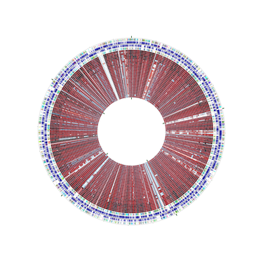

# CGView
CGView is a Java package for generating high quality, zoomable maps of circular genomes. Its primary purpose is to serve as a component of sequence annotation pipelines, and as a means of generating visual output suitable for the web.

Sample maps created using CGView are available [here](https://paulstothard.github.io/cgview/gallery.html).

Information on how to generate CGView maps is available [here](https://paulstothard.github.io/cgview/create_overview.html).

CGView was written and is maintained by Paul Stothard <stothard@ualberta.ca> 

## CGView citation

[Stothard P, Wishart DS (2005) Circular genome visualization and exploration using CGView. Bioinformatics 21:537-539.](https://pubmed.ncbi.nlm.nih.gov/15479716/)

## Downloading CGView

The executable cgview.jar with dependencies included can be downloaded [here](https://github.com/paulstothard/cgview/releases/).

To test cgview.jar on your system you can try the following:

```bash
wget https://paulstothard.github.io/cgview/xml_sample/overview.xml
java -jar cgview.jar -i overview.xml -o map.png
```

## Building CGView

The cgview.jar can be built from project source code using [Apache Maven](https://maven.apache.org).

First clone the cgview repository and switch to the project directory:

```bash
git clone git@github.com:paulstothard/cgview.git
cd cgview
```

Build the cgview.jar using **mvn package**:

```bash
mvn package
```

Alternatively, an included `build.sh` script can be used to execute **mvn package** and to run several additional tests:

```bash
./build.sh
```

The build process should create several CGView maps in the `test_maps` directory and updated API documentation and jar files in the `targets` directory.

## Executing CGView:

The command-line interface is described in detail in the [CGView documentation](https://paulstothard.github.io/cgview/application.html). The following information can be obtained using `java -jar cgview.jar --help`: 

```
CGView - drawing circular genome maps.

DISPLAY HELP AND EXIT:

  usage:

     java -jar cgview.jar --help

DISPLAY VERSION AND EXIT:

  usage:

     java -jar cgview.jar --version

CREATING A SINGLE MAP IMAGE:

   usage:

      java -jar cgview.jar -i <file> -o <file> [Options]

   required arguments:

      -i  Input file in CGView XML or TAB format.
      -o  Output file to create.

   optional arguments (when used these override corresponding values specified in XML input):

      -A  Font size for feature labels (default 10).
      -c  Base position to center on when using -z option (default 1).
      -D  Font size for legends (default 8).
      -d  Density of tick marks, between 0 and 1.0 (default 1.0).
      -f  Output file format: png, jpg, svg, or svgz.
      -H  Height of map (default 700).
      -h  HTML file to create for image map functionality.
      -I  Allow labels to be drawn on inside of circle, T or F (default is T for zoomed maps and F for unzoomed).
      -L  Width of user-supplied legend png file (legend.png) to be referenced in html output.
      -p  Path to image file in HTML file created using -h (default is -o value).
      -r  Remove legends, T or F (default F).
      -R  Remove feature labels, T or F (default F).
      -U  Font size for sequence ruler (default 8).
      -u  Include overlib.js calls for mouseover labels for png and jpg image maps in html output, T or F (default T).
      -W  Width of map (default 700).
      -z  Zoom multiplier (default 1).

   example usage:

      java -jar cgview.jar -i test.xml -o map.png -f png

CREATING A NAVIGABLE SERIES OF LINKED MAP IMAGES:

   usage:

      java -jar cgview.jar -i <file> -s <directory> [Options]

   required arguments:

      -i  Input file in CGView XML or TAB format.
      -s  Output directory for image series.

   optional arguments (when used these override corresponding values specified in XML input):

      -A  Font size for feature labels (default 10).
      -D  Font size for legends (default 8).
      -e  Exclude SVG output from image series, T or F (default F).
      -H  Height of map (default 700).
      -I  Allow labels to be drawn on inside of circle, T or F (default is T for zoomed maps and F for unzoomed maps).
      -L  Width of user-supplied legend png file (legend.png) to be referenced in html output.
      -r  Remove legends, T or F (default F).
      -U  Font size for sequence ruler (default 8).
      -u  Include overlip.js for mouseover labels for png and jpg image maps in html output, T or F (default T).
      -W  Width of map (default 700).
      -x  Zoom multipliers to use, comma-separated (default is 1,6,36).

   example usage:

      java -jar cgview.jar -i test.xml -s image_series
```


